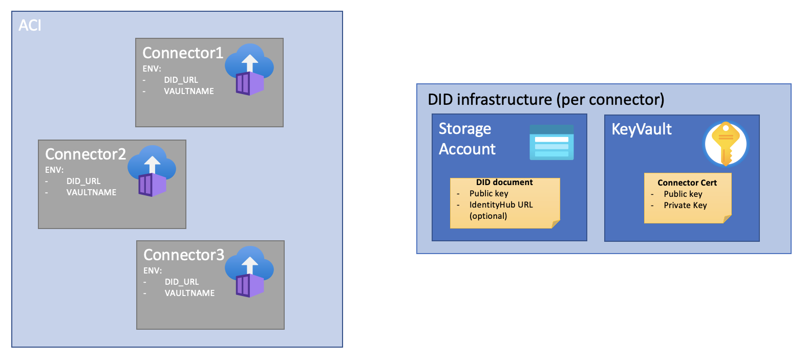
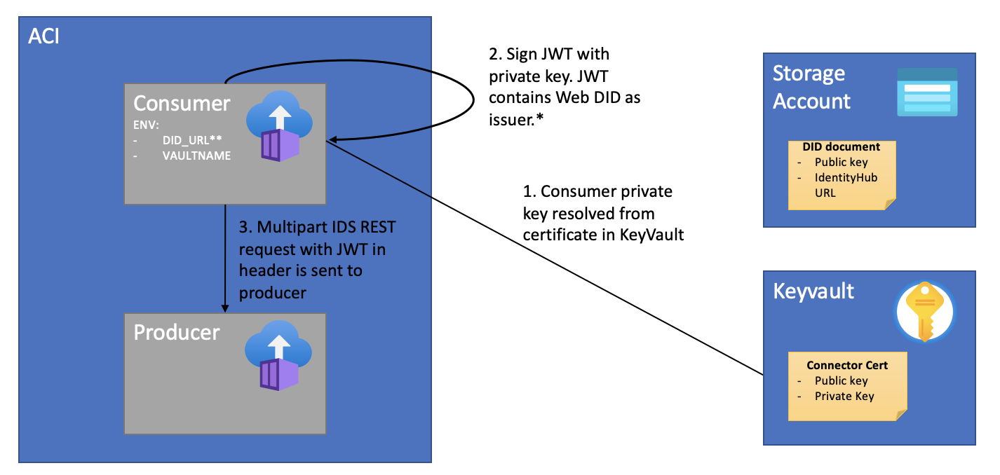
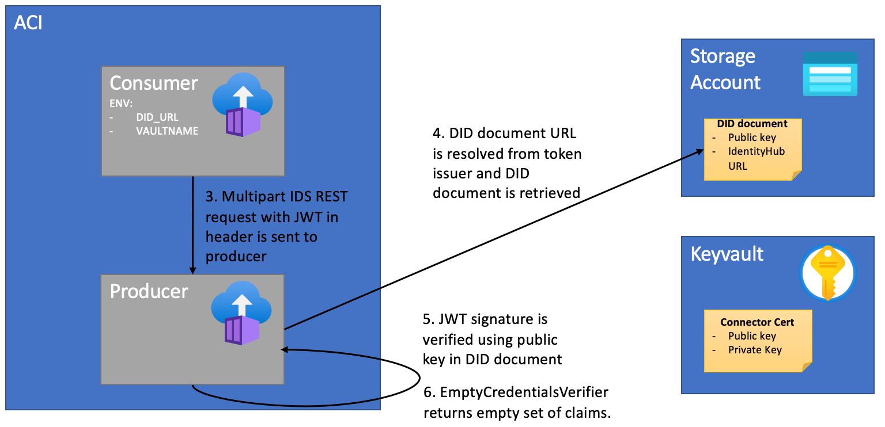

# Decentralized Identity

## Decision

Use DID Web to authenticate IDS calls between participants of the MVD (Minimal Viable Dataspace).

Authorization through claims obtained from Identity Hub and policies are out of scope of this document.

## Components

The following example shows the deployment of 3 connectors. Each connector requires the following infrastructure for DID Web:
- Storage account for hosting DID documents
- KeyVault for storing certificates

An automated terraform deployment should generate certificates, DID documents and deploy these Azure components for each connector instance automatically.

## Authentication flow

### Sending IDS requests

A JWT token is sent on each IDS request. The JWT is generated using the private key in the certicate available in the KeyVault of the consumer connector. The DID is set as issuer of the JWT token, which can be resolved to the URL of the corresponding DID document.

### Receiving IDS requests

Upon recieval, the provider connector verifies the JWT token. To achieve this, the DID URL is resolved from the DID available as the token issuer. The public key is retrieved from the DID document, which is then used by the provider connector to verify the JWT.

No Identity Hub integration is desired at this point. An `EmptyCredentialsVerifier` should be used, returning an empty claim collection. Identity Hub integration will be evaluated later together with policies.

