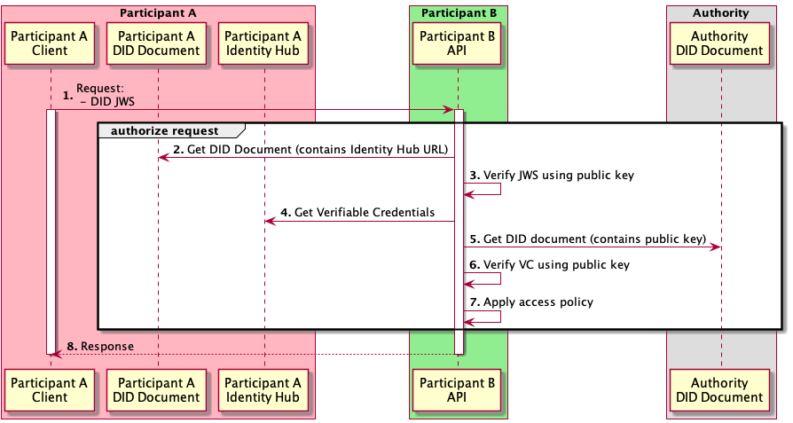

# Distributed authorization sub-flow

This sub-flow is used for a service to authenticate and authorize requests from a Dataspace Participant.

## Participants

1. _Participant A_, which performs a request to _Participant B_. (_Participant A_ could be a company enrolled within a dataspace.)
2. _Participant B_, which serves a request to _Participant A_, and needs to establish _Participant A's_ credentials. (_Participant B_ could be a company enrolled within a dataspace, or the Dataspace Authority, depending on the flow.)
2. _Authority_, which is an issuer of Verifiable Credentials of _Participant A_. (_Authority_ can be e.g. external Gaia-X Central Authority or Dataspace Authority, depending on the flow.) 

## Overview

_Participant A_ needs to establish its identity and credentials in order to access a service from _Participant B_. Selecting and transporting _Participant A's_ verifiable credentials in request headers would be too bulky and put too much logic in the client code. Therefore, _Participant A_ sends it's DID (in a JWS) and a bearer token, allowing _Participant B_ to authenticate the request, and obtain _Participant A's_ verifiable credentials from its Identity Hub.

A DID JWS cannot be used by _Participant B_ to authenticate itself to _Participant A's_ Identity Hub, as endless recursion would ensue.

## Pre-conditions

1. _Participant A_ has deployed an Identity Hub service, and a DID Document containing the Identity Hub URL.
2. The _Participant A_ Identity Hub contains VCs that satisfy the _Participant B's_ service access policy.
2. The _Authority_ has deployed a DID Document allowing to retrieve the public key.

## Flow sequence

1. The Client for _Participant A_ (which could be EDC, or any other application) sends a request to _Participant B's_ API. The client needs access to 
   _Participant A's_ Private Key to sign a JWS. (In future versions the client will send also a time-limited bearer token granting access to its Identity Hub.)
2. _Participant B_ retrieves the DID Document based on the DID URI contained in the JWS.
3. _Participant B_ authenticates the request by validating the JWS signature against the public key in the DID Document.
4. _Participant B_ finds Participant A's Identity Hub URL in the DID Document and retrieves Verifiable Presentation containing Verifiable Credentials from 
   _Participant's A_ Identity Hub. (In future versions Identity Hub will perform authentication using bearer token sent from _Participant B_.)
5. _Participant B_ retrieves the DID Document of the Participant A's Verifiable Credentials issuer.
6. _Participant B_ validates the VC signature against the public key in the DID Document.
7. _Participant B_ applies its access policy for the given service. This applies rules specific to a given service. For example, the caller must be a dataspace participant (i.e. have a valid Verifiable Credential signed by the Dataspace Authority, that establishes its dataspace membership).
8. _Participant B_ returns the service response if the request was successfully authorized, otherwise, an error response. Depending on the flow, the response can be synchronously or asynchronously returned.

